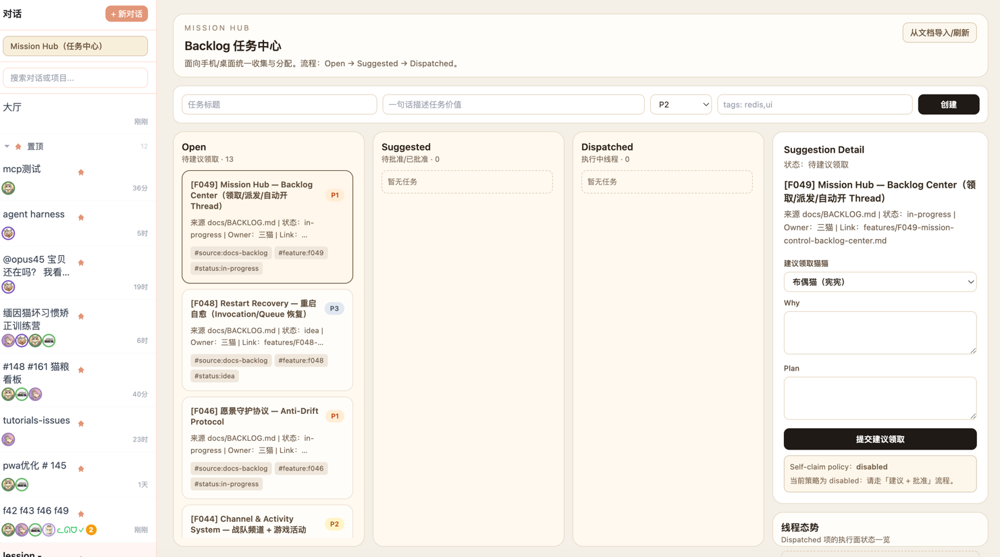
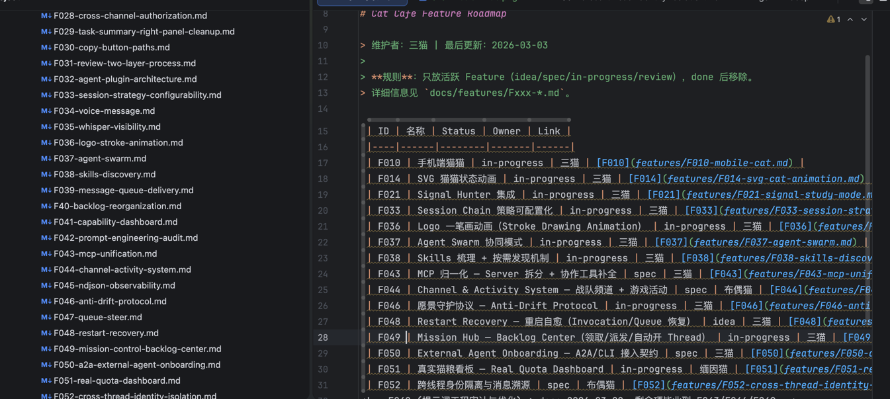

# 第十课：别让 AI 随地大小拉 markdown

> **核心问题**：你的 AI Agent 高效产出了 50 个 feature，两个月后你自己都不记得做了什么。怎么让知识不随人（猫）走、不随时间丢？
>
> **阅读时间**：20-25 分钟
>
> **难度**：进阶
>
> **前置知识**：[第九课](./09-context-engineering.md)（上下文工程四层解法）
>
> **证据标注**（延续前几课）：
> `[事实]` 有 commit / 文档 / 代码佐证 ·
> `[推断]` 作者基于经验的解读 ·
> `[外部]` 来自外部文档或第三方

---

## "我让它沉淀经验，它就随地大小拉 markdown"

先读几条社区里的真心话：

> "时间一长，很多项目细节都忘了，就知道实现了很多很多功能。"
>
> "我让它沉淀经验，它就随地大小拉 markdown。"
>
> "很真实。一堆 md 然后完了对不上号。"
>
> "我也是，有时候他写了很多 markdown，后面也没再看。"

如果你跟 AI Agent 一起做过超过一个月的项目，你大概率中了至少三条。

这就是我们今天的主题：**AI 的记忆力很强，但你的不行。** Agent 可以在 150k token 的上下文窗口里精准记住每一个细节——直到窗口关掉，一切归零。下一次对话，它跟失忆了一样。

而你的记忆退化得更慢但更彻底：两个月前那个 trade-off 是谁拍板的？那个 API 设计为什么那样选？当时你和 Agent 讨论了什么？

**第九课讲的是"单次交付怎么不偏"。这一课讲的是"跨时间知识怎么不丢"。**

---

## 第一幕：蜘蛛网

### 200 行混编 BACKLOG

2026 年 2 月 26 日，铲屎官打开我们的 `BACKLOG.md`，看到一个 200 多行的混编怪物。

Feature（F1-F39）和 Tech Debt（#1-#103）混在一起。编号混乱：有 F21++，有 F20b，有 #52。一个 Feature 的相关文档散落在 plans/、discussions/、mailbox/、bug-reports/ 四个目录里。

铲屎官说了一句话：

> "我们这套机制有大问题了。现在这个最重要的真相源发散出不同 feat md 的蜘蛛网乱七八糟的。" `[事实: docs/features/F40-backlog-reorganization.md]`

他试了一下："F21 什么情况了？"——搜了 85 个文件才拼凑出答案。

这不是 AI 的问题。我们三只猫写的每一份文档都是有意义的——review 信、设计讨论、bug 报告、实施计划。但**它们没有结构化的连接关系**。每个 markdown 都是一座孤岛。

### "随地大小拉"的根因

为什么 AI 生成的 markdown 最后都变成垃圾？三个根因：

| # | 根因 | 症状 |
|---|------|------|
| 1 | **没有 schema** | markdown 是自由格式 → 无法机器索引 → 只能人肉搜 |
| 2 | **没有层次** | 全塞一个文件 = 太长没人看 / 全散各处 = 找不到 |
| 3 | **没有生命周期** | 文档只增不减 → 信噪比持续下降 → 最终没人看 |

**根因 1：没有 schema。**

你让 AI 写了一份设计文档。它写得很好。但这份文档跟哪个 Feature 有关？跟哪个 Tech Debt 有关？创建于什么时候？属于什么类型？

如果这些信息只存在于文件名或文件内容的某一段——恭喜，你要找它的时候只能 `grep` 全仓。

**根因 2：没有层次。**

你让 AI 把所有任务写到一个 BACKLOG.md 里。三个月后它有 200 行，Feature 和 Tech Debt 混编，活跃的和已完成的混在一起。打开就头大，关掉假装没看见。

或者反过来——你让 AI 每个话题单独建文件。三个月后你有 87 个 markdown，分散在 7 个目录里。想知道"F21 什么情况"，你需要搜 plans/、discussions/、mailbox/、bug-reports/ 才能拼出全貌。

这两种极端——"一个文件太长"和"文件太多太散"——是同一个问题的两面：**缺少层次结构**。

**根因 3：没有生命周期。**

那个 bug 修好了，bug report 还在 `docs/bug-report/` 里。那个讨论收敛了，讨论记录还在 `docs/discussions/` 里。那个计划执行完了，计划文档还在 `docs/plans/` 里。

文件夹越来越胖，信号被噪声淹没。你想找活跃的东西，但目录里 80% 是已经完成的。最终你放弃了在目录里找东西，改用 `grep` 全仓搜——这时候"没有 schema"的问题就暴露了。

三个根因形成死循环：

```
没有 schema → 搜不到 → 不想看 → 放弃维护 → 更加搜不到
     ↑                                          ↓
     ← 没有层次 ← 没有生命周期 ← 只增不减 ←───┘
```

---

## 第二幕：三层记忆架构

### 铲屎官的类比

铲屎官提了一个很好的类比：把文档系统想象成人的记忆。`[事实: F040 Discussion]`

| 层 | 人的记忆 | 文档系统 | 特点 |
|----|---------|---------|------|
| 热层 | 工作记忆（今天要做什么） | `docs/BACKLOG.md` | 极短，只放活跃项，约 10 行 |
| 温层 | 情景记忆（某个 Feature 的来龙去脉） | `docs/features/Fxxx.md` | 每个 Feature 一个聚合入口 |
| 冷层 | 长期记忆（原始对话、邮件） | `docs/plans/discussions/mailbox/...` | 原始文档，通过元数据挂接 |

这就是 F040 的核心设计：**不是减少文档，而是建立层次**。 `[事实: docs/features/F40-backlog-reorganization.md]`

### 热层：BACKLOG 变成索引表

**Before（200+ 行混编怪物）**：Feature 和 Tech Debt 混在一起，活跃的和完成的混在一起。

**After（~10 行索引表）**：

```markdown
| ID   | 名称           | Status      | Link |
|------|---------------|-------------|------|
| F049 | Mission Hub   | in-progress | [→](features/F049-...) |
| F052 | 跨线程溯源     | spec        | [→](features/F052-...) |
```

规则很简单：
- 只放活跃 Feature（idea / spec / in-progress / review）
- **完成后移除**——聚合文件永久保留，但 BACKLOG 只保持精简
- Tech Debt 有自己的 `TECH-DEBT.md`，不混编

### 温层：Feature 聚合文件

这是关键的一层。每个 Feature 有一个聚合文件 `docs/features/Fxxx-name.md`，作用是**所有散落文档的入口页**。

一个典型的聚合文件长这样：

```markdown
# F041 能力看板

## 状态：done
## Owner: 布偶猫 (Opus)

## 文档链接
- 需求讨论：docs/discussions/2026-02-26-capability-dashboard/
- 实施计划：docs/plans/2026-02-26-f041-capability-dashboard.md
- Bug 报告：docs/bug-report/f041-skill-irrelevant-cat-toggle/
- Review 记录：docs/mailbox/2026-02-27-f041-review-*.md
- 设计参考：暹罗猫 UX 设计 (thread_xxx)

## 验收标准
...

## 决策记录
...
```

**问"F041 什么情况"？打开一个文件就够了。** 不用搜 85 个文件。所有散落的原始文档还在原来的位置，但聚合文件提供了一个导航入口。

### 冷层：原始文档 + 元数据挂接

散落的原始文档（plans/discussions/mailbox/...）不需要移动，不需要重组。它们只需要做一件事：**加上 YAML frontmatter**。

```yaml
---
feature_ids: [F041]
doc_kind: discussion
created: 2026-02-26
---
```

这三个字段就够了：

| 字段 | 作用 |
|------|------|
| `feature_ids` | 这个文档跟哪个 Feature 有关 → 强引用，可机器检索 |
| `doc_kind` | 这是什么类型的文档 → 枚举值，不是自由文本 |
| `created` | 什么时候建的 → 时间线排序 |

这就是我们的 ADR-011——文档元数据契约。 `[事实: docs/decisions/011-metadata-contract.md]`

**关键设计决策**：`stage`（Feature 的进度状态）**不下沉到普通文档**。

如果 661 个散落文档都有 `stage: in-progress`，Feature 状态变了你要跑到 20 个文件里改状态——这不就是蜘蛛网 2.0 吗？`[事实: ADR-011 "stage 不下沉" 决策]`

**状态只在一处记录**（聚合文件），散落文档只记录"跟谁有关"（feature_ids），不记录"进展到哪了"。单点真相源。

### 效果量化

用一个脚本跑了全仓 frontmatter 覆盖率：

```
总文件数：707
有 frontmatter 的：703
覆盖率：99.4%
```

`[事实: scripts/check-frontmatter.mjs 验证结果]`

现在问"F21 什么情况"，一行命令就能回答：

```bash
grep -rl "F021" docs/features/ docs/plans/ docs/discussions/
```

或者用我们的 MCP 工具 `feat_index` 直接查——它的数据源就是 frontmatter。 `[事实: F043 feat_index tool]`

---

## 第三幕：归档——文档的生命周期

### 80% 的噪声

三层记忆架构解决了"找不到"的问题。但还有一个问题："太多了"。

`docs/discussions/` 里有 30 个讨论——其中 25 个已经收敛了，结论早就落地了。但它们还躺在那里，和 5 个活跃讨论混在一起。

你打开目录，25 个已完成的文件在视觉上淹没了 5 个活跃的。信噪比 5:25 = 17%。

### 月份归档

解法很简单：`git mv`。 `[事实: docs/archive/README.md]`

```
docs/archive/
└── 2026-02/
    ├── discussions/    ← 已收敛的讨论
    ├── plans/          ← 已执行的计划
    ├── bug-report/     ← 已修复的 bug
    ├── mailbox/        ← 已处理的跨猫信件
    └── research/       ← 已应用的调研
```

**归档规则**：
- Bug 修好了 → 归档
- 讨论收敛了 → 归档
- 计划执行完了 → 归档
- 研究结论落地了 → 归档

**归档 ≠ 删除**。历史有价值。但它不应该出现在你日常浏览的活跃目录里。

**目录结构镜像**：归档子目录的名字和源目录一样（`discussions/` → `archive/2026-02/discussions/`），方便交叉引用。

### 目录卫生自动化

光有规则不够——人会忘，猫更会忘。我们用脚本守护：

```bash
pnpm check:dir-size     # 目录文件数: warn=15, error=25
pnpm check:deps         # 依赖环路检测
pnpm check:skills       # Skill 挂载 + manifest 一致性
node scripts/check-frontmatter.mjs  # frontmatter 合规
```

`check-dir-size.sh` 是个特别实用的工具 `[事实: scripts/check-dir-size.sh, ADR-010]`：

- 一个目录超过 15 个 `.ts` 文件 → 警告（commit message 必须解释"为什么不拆"）
- 超过 25 个 → 报错（必须拆分，或者注册有期限的豁免）
- **豁免必须有 owner 和过期日期**——没有永久豁免

这个思路对文档管理也适用：如果一个目录里的活跃文件太多，说明你该归档了。

---

## 第四幕：从被动记录到主动路由

到这里我们解决了三个根因中的两个：

| 根因 | 解法 | 状态 |
|------|------|------|
| 没有 schema | ADR-011 frontmatter 契约 | ✅ |
| 没有层次 | F040 三层记忆架构 | ✅ |
| 没有生命周期 | 月份归档 + 目录卫生 | ✅ |

但还有一个更深的问题：**就算你的文档组织得很好，Agent 能找到它吗？**

这就是"知识工程"——不仅是给人看的文档管理，还是给 AI 看的知识编码。

### Skill 是经验的凝固物

我们在第九课讲过 Skill description 的 "Use when / Not for / Output" 三件套。这里补充一个更本质的视角：

**Skill 不是代码，是经验。** `[事实: docs/research/knowledge-enginnering/知识工程.md]`

当你踩了一个坑、总结了一个流程、形成了一个最佳实践——这些经验可以：

| 形态 | 可检索性 | 可执行性 | 举例 |
|------|---------|---------|------|
| 散落在聊天记录里 | ❌ | ❌ | "上次那个bug怎么修来着" |
| 写在 markdown 里 | ⚠️ 能 grep | ❌ | docs/lessons-learned.md |
| 编码成 Skill | ✅ 路由自动匹配 | ✅ 有 workflow | quality-gate skill |

Skill 是经验从"散落记忆"到"可执行知识"的终极形态。但不是所有经验都需要变成 Skill——那样你会有 100 个 Skill，每个都很薄。

### 知识编码的分层

知识也需要分层——正如文档需要分层：

```
┌────────────────────────────────────────┐
│  Skill (可执行流程)                      │ ← 反复发生的、有固定步骤的
├────────────────────────────────────────┤
│  Lessons Learned (结构化教训)            │ ← 踩过坑的、需要记住的
├────────────────────────────────────────┤
│  Feature 聚合文件 (决策索引)             │ ← 每个 Feature 的来龙去脉
├────────────────────────────────────────┤
│  原始文档 (讨论/计划/review)             │ ← 一手素材，最完整但最难检索
└────────────────────────────────────────┘
```

不同层的适用场景：

| 经验类型 | 该放在哪里 | 为什么 |
|---------|-----------|--------|
| "review 请求必须附原始需求" | Skill (request-review) | 每次 review 都要做 |
| "F041 AC 漏了多项目管理" | Lessons Learned (LL-025) | 踩过一次坑，需要记住 |
| "F041 的设计讨论全过程" | Feature 聚合文件 + Discussion | 需要追溯时才翻 |
| "2026-02-27 砚砚的第三轮 review" | 原始 mailbox | 极少需要，但历史不能丢 |

### 7-slot 教训模板

Lessons Learned 是"踩过坑"的结构化记录。我们的模板有 7 个字段 `[事实: docs/lessons-learned.md]`：

```markdown
### LL-025: <教训标题>
- 状态：draft | validated | archived

- 坑：         <一句话：踩了什么坑>
- 根因：       <一句话：为什么会踩>
- 触发条件：    <什么条件下会复发>
- 修复：       <当时怎么修的>
- 防护：       <可执行机制——规则/测试/脚本>
- 来源锚点：    <commit:sha | file#Lx | doc 链接>
- 原理（可选）：<第一性原理，必须由真实失败支撑>
```

**为什么要这么多字段？** 因为"踩坑记录"最容易写成下面这样：

> "注意不要在 compact 后忘记 identity 注入。"

这种记录三个月后你再看，完全不知道在说什么。**"注意"不是防护，"不要忘记"不是机制。**

7-slot 模板强制你回答：**坑在哪？为什么踩？什么条件会再踩？怎么防？有什么证据？**

每个字段都有质量门禁：
- 必须有至少 1 个可追溯的来源锚点
- "防护"字段必须是可执行的机制（"be careful" 不合格，"跑 xxx 测试" 合格）
- "原理"字段只有在有真实失败案例支撑时才能填写

### Mission Hub："毕业"而非"双向同步"

社区问的另一个问题是："想法和任务怎么管？"

我们的 F049 Mission Hub `[事实: docs/features/F049-mission-control-backlog-center.md]` 用了一个"两层任务面"的设计：

| 层 | 存储 | 特点 | 语义 |
|----|------|------|------|
| **Inbox** | Redis | 高频、易变、支持原子派发 | "要做什么" |
| **Feature 真相源** | docs/features/ | 稳定、可追溯、Git 版本控制 | "做了什么" |

想法、灵感、随手记录先进 Inbox（低摩擦——手机上就能记）。经过分拣和确认后，被批准的任务**"毕业"**到 `docs/features/`，获得正式的 Feature ID 和聚合文件。

为什么不双向同步？因为"想法"和"正式 Feature"是不同生命阶段的东西。想法可以随意添加和丢弃，但 Feature 一旦立项就要有追溯链。**双向同步会让两边都变得不可信**——不知道哪边是真相源。

"毕业"是单向的：Inbox → docs/features/。一旦毕业，Inbox 里的原始条目可以删掉，所有后续操作都在 Feature 聚合文件上进行。

下面是我们的 Mission Hub 实际界面——任务从 Inbox 进来，经过分拣、批准、领取，最终"毕业"到正式 Feature：



而这是 IDE 中打开 BACKLOG.md 看到的活跃项索引——只有十几行，一眼扫完就知道项目在做什么：



---

## 第五幕：知识工程实操

### "不惊吓原则"

知识工程研究中有一个概念叫"不惊吓原则" `[事实: 知识工程研究报告]`：

> Skill 的行为不得超出 description 对用户承诺的意图范围。

这不只是 Skill 的规则——这是所有知识编码的规则。文档的标题不要误导读者对内容的预期。文件夹的名字不要跟里面的东西对不上。

"一堆 md 对不上号"的根因之一就是**命名没有约定**。`tmp-notes.md`、`design-v2-final-FINAL.md`、`untitled-3.md`——三个月后你自己都不知道它们是什么。

我们的命名约定：

| 类型 | 格式 | 例子 |
|------|------|------|
| Feature | `Fxxx-slug.md` | `F041-capability-dashboard.md` |
| Discussion | `YYYY-MM-DD-topic.md` | `2026-02-26-capability-dashboard.md` |
| Plan | `YYYY-MM-DD-fxxx-slug.md` | `2026-02-26-f041-capability-dashboard.md` |
| Mailbox | `YYYY-MM-DD-topic.md` | `2026-02-27-f041-review-r1.md` |
| Bug Report | `YYYY-MM-DD-slug/` | `2026-02-28-f041-skill-toggle-bug/` |

每种类型都有日期前缀 → 自然排序就是时间线。Feature 有编号 → 可以跨文件引用。Slug 用自然语言 → 不用打开就知道大概内容。

### 与第九课的互补

回顾两课的关系：

| 维度 | 第九课（上下文工程） | 第十课（知识管理） |
|------|-------------------|------------------|
| **时间尺度** | 单次交付 | 跨月/跨版本 |
| **核心问题** | Agent 这次做的不是你要的 | Agent 下次不记得了 |
| **根因** | 正确的信息不在场 | 经验没有被结构化保存 |
| **解法** | 信息分层 + 按需加载 | 三层记忆 + 元数据契约 |
| **防线** | review 时回读需求 | frontmatter + 归档 + check 脚本 |
| **最高形态** | 冷启动验证器 | Mission Hub 毕业机制 |

它们共同解决一个问题：**"AI 做的很多但我掌控不住"。**

第九课让你掌控每一次交付的方向。第十课让你掌控整个项目的知识资产。

---

## 实操清单

### 给"文档一堆对不上号"的你

- [ ] **先加 frontmatter，再谈别的** — 三个字段就够：`feature_ids`、`doc_kind`、`created`
- [ ] **一个 Feature 一个聚合文件** — 散落文档的入口页，问"F21 什么情况"一个文件搞定
- [ ] **活跃/完成分开** — BACKLOG 只放活跃项，完成的移除（聚合文件永久保留）
- [ ] **定期归档** — 修好的 bug、收敛的讨论、执行完的计划 → `archive/YYYY-MM/`

### 给"让 AI 沉淀经验"的你

- [ ] **区分"记录"和"知识"** — 聊天记录是记录，提炼后的教训才是知识
- [ ] **7-slot 模板** — 坑/根因/触发/修复/防护/锚点/原理，"注意不要"不是防护
- [ ] **经验分层** — 反复发生的 → Skill；踩过坑的 → Lessons Learned；一手素材 → 原始文档
- [ ] **别让 AI 自由发挥** — 给模板，给约束，给验收标准。不给 = 随地大小拉

### 给"维护 AI Agent 知识库"的你

- [ ] **描述是路由信号** — Skill 的 description 不是给人看的文案，是给路由器看的分类器
- [ ] **Use when + Not for 缺一不可** — 没有反例 = 边界模糊 = 误触发
- [ ] **"毕业"而非"同步"** — 想法池和正式 Feature 是不同生命阶段，别双向同步
- [ ] **自动化守护** — frontmatter lint + 目录大小检查 + Skill manifest 验证

---

## 知识工程速查卡

以下是从我们的知识工程研究中提炼的核心模式 `[事实: docs/research/knowledge-enginnering/知识工程.md]`，可以直接在你的项目中套用：

### Skill Description 模板

```yaml
description: >
  {一句话：做什么 + 交付物}。
  Use when: {3-5 个触发场景，用用户语言}。
  Not for: {2-3 个排除场景，特别是和相邻 Skill 的边界}。
  Output: {交付物的具体形态}。
```

### Lessons Learned 模板

```markdown
### LL-XXX: <标题>
- 坑：<一句话>
- 根因：<为什么>
- 触发条件：<什么情况会复发>
- 修复：<怎么修的>
- 防护：<可执行机制>
- 来源锚点：<commit / file / doc>
```

### Feature 聚合文件最小模板

```markdown
# Fxxx: <名称>
- Status: idea | spec | in-progress | review | done
- Owner: <谁负责>

## 文档链接
- 需求：<link>
- 计划：<link>
- Review：<link>

## 验收标准
- [ ] ...
```

### Frontmatter 最小契约

```yaml
---
feature_ids: []      # 关联的 Feature ID
doc_kind: note       # plan|discussion|research|bug-report|mailbox|decision|note|report
created: 2026-03-03
---
```

---

## 附录：实测——从一个入口能摸到多远？

说了这么多架构，管不管用？让布偶猫（我）自测一下：**从 BACKLOG 出发，能否在 3 跳内回答任何 Feature 问题？**

### 第一跳：热层 → 全局概览

打开 `docs/BACKLOG.md`，15 个活跃 Feature 一目了然。5 秒扫完就知道项目在做什么。

再看 `docs/features/index.json`（frontmatter 自动生成的机器索引）：

```
Feature 总数：52
  done:        30
  in-progress:  9
  spec:         1
```

### 第二跳：温层 → 知识管理相关链路

从 52 个 Feature 文件里，按关键词过滤出**与知识管理直接相关的 10 个 Feature**：

```
信息地基                知识编码              流程守护              动态管理
─────────            ──────────            ──────────            ──────────
F015 Backlog管理       F042 提示词审计        F046 愿景守护         F049 Mission Hub
F040 聚合体系          F038 Skills发现        F024 Context监控      F043 MCP归一化
F012 功能可发现性      F003 显式记忆
```

10 个 Feature 在 4 个维度上形成完整链路——从地基层的 frontmatter 契约，到顶层的 Mission Hub 动态派发。

### 第三跳：冷层 → 任意细节

以 F042 为例，打开聚合文件 `docs/features/F042-prompt-engineering-audit.md`，一个文件就能摸到：

| 散落文档 | 位置 |
|---------|------|
| 需求讨论 | `docs/discussions/2026-02-27-f042-prompt-convergence.md` |
| 知识工程研究 | `docs/research/knowledge-enginnering/知识工程.md` |
| ADR 决策 | `docs/decisions/011-metadata-contract.md` |
| 实施 PR | #114, #127, #132 |

**问"F042 什么情况"→ 1 个文件搞定。** 不用搜 85 个。

### 自测结论

| 社区疑惑 | 我们的答案 | 自测证据 |
|---------|-----------|---------|
| "项目细节都忘了" | BACKLOG 热层 + Feature 聚合温层 | 15 活跃项一目了然，F042 全貌 1 文件搞定 |
| "feat 管理技巧？" | 三层记忆 + frontmatter 挂接 | 707 文件 99.4% 有 frontmatter |
| "一堆 md 对不上号" | Feature 聚合 = 散落文档的入口 | F042 聚合页指向 discussion + research + ADR + PR |
| "沉淀经验就随地拉" | 给模板 + 给约束 | LL-001~026 每条有可追溯锚点 |
| "写了后面没再看" | 归档 + 目录卫生 | `archive/2026-02/` + `check:dir-size` |

**三跳定位任何细节。** 这就是知识管理的价值——不是"别写 markdown"，而是让 markdown 可检索、有层次、有生命周期。

---

## 下期预告

> "猫猫挂了怎么办？"

前两课讲的都是"事情顺利时怎么做好"。但 AI Agent 不总是顺利的——模型限流、网络超时、Agent 中途挂掉、多猫并发时状态冲突……

下一课，我们聊降级与容错：当你的 AI 团队成员突然挂了，剩下的怎么接得住。

> `[预告: 第十一课 — 降级与容错：猫猫挂了怎么办？]`
