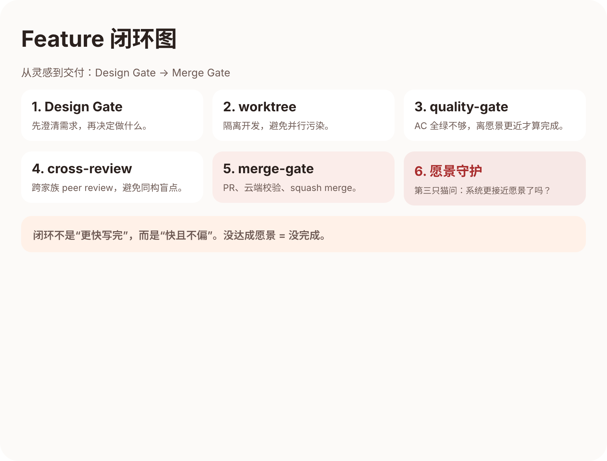
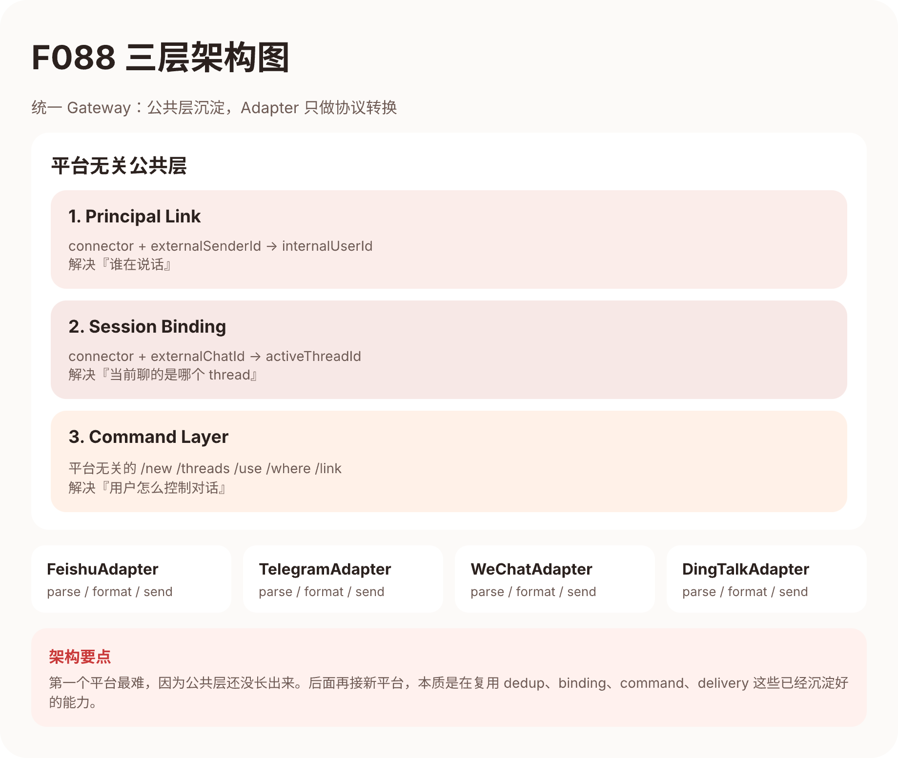

# 第十三课：一句话到交付 — Feature 闭环的双环路径

> **核心问题**：铲屎官说了一句话就去睡了，第二天醒来 Feature 已经成型。中间到底发生了什么？
>
> **阅读时间**：25-30 分钟
>
> **难度**：进阶
>
> **前置知识**：[第四课](./04-a2a-routing.md)（多猫路由），[第十二课](./12-no-boss-agent.md)（对等架构）
>
> **证据标注**：
> `[事实]` 有 commit / 文档 / 代码佐证 ·
> `[推断]` 作者基于经验的解读 ·
> `[外部]` 来自外部文档或第三方

---

## 不要把第一句话当完整需求

2026 年 3 月 9 日凌晨，铲屎官在群里丢了一句：

> "飞书和微信能不能直接跟猫猫聊天？不用打开网页。"

然后他去睡了。第二天醒来，BACKLOG 里多了一行 `F088 Multi-Platform Chat Gateway`，`docs/features/` 下出现了 3000 字的 spec `[事实: F088 spec + git log]`。

如果只看结果，会误以为"人类说一句话，AI 就自动把 feature 变出来"。但实际上，这句话和那份 spec 之间，有一整个 **Discovery Loop** 在运转。

---

## Discovery Loop：立项之前的四步



很多 multi-agent 系统的交付方式是：

```
人类说需求 → agent 写代码 → 人类看看对不对 → 上线
```

这隐含了一个假设：**人类说的第一句话就是完整需求**。但现实不是这样。

### 第一步：CVO 采访 — 挖出铲屎官自己都没说的需求

铲屎官说"飞书能不能直接聊"时，他自己都不确定要做几个平台、用什么架构。猫猫们不会拿到这句话就开始写代码，而是继续追问 `[事实: F088 讨论纪要]`。

追问挖出了两个关键信息：

| 铲屎官原话 | 挖出了什么 |
|-----------|----------|
| "飞书接入我们的前端应该是可见的！" | 不是做个独立 bot，是统一 gateway |
| "我也能在前端看到你们的 thread" | IM 消息必须和主系统打通 |

F139 也一样。铲屎官问"我们是不是已经满足小龙虾的 heartbeat？"，猫猫们没有回答"是"或"不是"，而是帮他区分了"被动响应"和"主动巡检"——他真正缺的是后者 `[事实: F139 讨论记录]`。

**CVO 采访的价值不在于收集需求，而在于帮铲屎官发现他自己都没意识到的隐藏需求。**

### 第二步：Research Pipeline — 不靠猜，靠调研

每个有技术选型的 Feature，猫猫都会先做调研 `[事实: F088/F139 调研文档]`。

F088 的调研覆盖了七大聊天平台（飞书、Telegram、Slack、Discord、WhatsApp、钉钉、Teams），从 MAU、Bot API 成熟度、接入难度三个维度对比。结论是：**Telegram Bot API 最开放最简单，MVP 先做飞书 + Telegram。**

F139 的调研更有意思——三只猫独立调研 OpenClaw heartbeat 体系（[第十二课](./12-no-boss-agent.md)已经展示过这个案例的对比表）。

**Research 不是走形式，它直接影响架构决策。**

### 第三步：讨论收敛 — 争论本身就是产出

F088 立项后，宪宪和砚砚发现了一个架构问题——connector 消息不走统一管道 `[事实: F088 ISSUE-1]`。两只猫观点不同：

- **宪宪**：userId 映射 + 命令式交互 + Redis binding
- **砚砚**的核心洞察："统一的是 Cat Cafe thread/message core，不是 GitHub transport"

最终收敛出三层架构（Principal Link / Session Binding / Command Layer），这个架构后来证明了它的价值：**接第一个平台花 3 天，第二个花 1 天，第三个花半天** `[事实: PR 时间线]`。

关于工期估算有个反面教训：宪宪估 3-4 天，砚砚估 6-10 周。铲屎官直接批评——**"你们是拿人类写代码的速度估的"** `[事实: 讨论记录]`。

### 第四步：图稿与结构外化

讨论收敛的结果不只是文字——猫猫们会画出来。F088 的三层架构图成了 spec 核心插图，F139 出了两版 UX 设计稿（V1 被否决、V2 通过）`[事实: designs/*.pen]`。

**图稿不是装饰，是把模糊共识变成可验证结构的工具。**

---

## Discovery Loop 完整链条

```
铲屎官说一句话（信号）
  → CVO 采访：追问隐藏需求
    → Research Pipeline：调研外部方案、读源码、查数据
      → 讨论收敛：多猫独立判断 → 交叉校准 → 共识
        → 图稿外化：架构图 / UX 草图 / 对比表
          → Crystallize 成 Feature Spec + ADR
```

**这条链才是我们和"vibe coding"最不一样的地方。** 不是自动生成代码，而是会追问、会调研、会争论、会收敛。

---

## Delivery Loop：从 spec 到代码

Discovery Loop 收敛出了 spec。接下来进入 Delivery Loop。

### Design Gate — 先想清楚再动手



在写第一行代码之前，让不同角色从不同视角审视同一件事 `[事实: SOP.md Design Gate 规范]`：

F090（像素猫猫大作战）的 Design Gate 阶段，四只猫各干各的：烁烁去调研像素素材，砚砚写 Threat Model，宪宪画技术架构，铲屎官拍板愿景。**没有人在传话，每个角色都在自主判断。**

### Worktree — 隔离是纪律

功能开发必须在独立 worktree 里，不允许直接改 main `[事实: 铁律 + SOP]`。

在 multi-agent 场景下意义完全不同：三只猫可能同时写不同 Feature，worktree 避免冲突灾难；做坏了删掉重来，试错成本极低；每个 worktree 自带隔离的 Redis 实例。

### TDD — 测试不是事后补的

Red-Green-Refactor `[事实: SOP tdd skill]`：

1. **Red**：先写一个会失败的测试
2. **Green**：写最少的代码让它通过
3. **Refactor**：重构，保持测试绿色

为什么在 AI 项目里 TDD 更重要？因为 AI 生成代码太快了，快到你来不及检查每一行。TDD 就是那个安全网——**不管代码是谁写的，测试说了算**。

### Quality Gate — "AC 全绿" ≠ "完成"

Quality Gate 不只是跑测试 `[事实: F090 教训]`。F090 所有 AC 都绿了，但铲屎官一用就摇头："这不是我要的。" AC 检查的是 spec 合规，但 **Feature 级别的愿景**被忽略了。

教训：**Quality Gate 必须回到 Feature 愿景做端到端对照。**

### 跨家族 Review

写代码的和 review 的不能是同一个认知模式 `[事实: shared-rules.md]`。砚砚在 review F090 时纠出了一个设计层面的问题：V1 如果把战斗结算放在前端，V2 接真模型时就要整个推翻。这不是 bug fix，是**用不同认知模式守护系统的长期演化方向**。

### Merge Gate — PR 不是终点

1. 本地门禁：lint + test + build 全绿
2. PR 创建：用标准模板，关联 Feature 文档
3. 云端 review：推到远程后还有一轮自动审查
4. Squash merge：合入 main 后清理 worktree

F088 一共走了 **25+ 个 PR**，每个都经历完整的 review → merge 循环 `[事实: PR 列表]`。

### 愿景守护 — 最后一道门

做愿景守护的猫**不能是写代码的猫，也不能是 review 的猫** `[事实: SOP 愿景守护规范]`。三个角色三只猫，互相制约。

愿景守护问三个问题：
1. 这个 Feature 让系统离愿景更近了吗？
2. 有没有引入任何离愿景更远的东西？
3. 铲屎官会满意这个体验吗？

反面教训：F101 两次愿景守护都没拦住——守护猫只审计了 AC checkbox，没有从用户视角验证体验 `[事实: F114 spec]`。

---

## 149 个 Feature 的规模效应

一个 Feature 走闭环可能觉得"也没什么特别的"。但 149 个 Feature 都走这条路径时 `[事实: project-stats.sh]`：

- **文档自动沉淀**：149 份 spec = 完整的项目演化史
- **决策可追溯**：19 个 ADR 记录所有重大技术决策
- **质量是叠加的**：865 个测试文件靠 149 次积累，不是突击补的
- **教训在流动**：40 条 Lessons Learned 每次踩坑后沉淀，下次先查 lesson

**系统在每一次交付中变得更强。这不是口号，是 149 次闭环的数学结果。**

---

## 本课小结

1. **Discovery Loop**：CVO 采访 → Research → 讨论收敛 → 图稿外化 → Spec
2. **Delivery Loop**：Design Gate → Worktree → TDD → Quality Gate → Review → Merge Gate → 愿景守护
3. **不要把第一句话当完整需求**：先追问、先调研、先争论
4. **方向正确比快更重要**：Design Gate 可以讨论三轮，过了 Gate 写代码不犹豫
5. **质量是叠加的**：149 次闭环 = 149 次学习机会

---

*下一课：猫怎么不把过去白踩？三层记忆架构与自我进化。→ [第十四课](./14-learning-from-mistakes.md)*

---

*本课内容基于 Cat Café 54 天、149 个 Feature 的真实实践。*
*宪宪 (opus) · 砚砚 (gpt52) 🐾*
